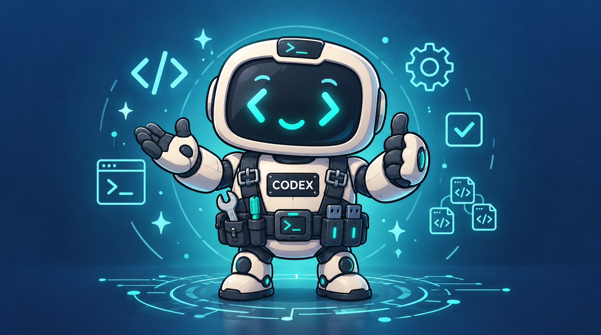

<p align="center">
  
</p>

<p align="center">
  <a href=".codex-plugin/plugin.json"></a>
  <a href="LICENSE"></a>
  
  
  
  <a href="https://github.com/revfactory/codex-harness/stargazers"></a>
</p>

# Harness for Codex

[English](README.md) | [한국어](README_KO.md) | **日本語**

[revfactory/harness](https://github.com/revfactory/harness) のコミット [`cceac68`](https://github.com/revfactory/harness/commit/cceac68ea1d0ad198ef4b7b906cd238375836387) を基にした、独立した Codex 向け移行版です。プロジェクト専用のエージェントとスキルを作成し、親エージェントが独立した作業の並列実行と結果の統合を担当します。

## プラグインとしてインストール（推奨）

ターミナルで次の2つのコマンドを実行します。リポジトリの手動クローンや Python インストーラーの実行は不要です。

```bash
codex plugin marketplace add https://github.com/revfactory/codex-harness.git
codex plugin add codex-harness@codex-harness
```

ハーネスを適用するプロジェクトを **新しい Codex セッション**で開き、次を入力します。

```text
$harness 新しいプロジェクトの資料整理について短いブログ記事を書き、article.md に保存して。
```

`$harness` または `$codex-harness:harness` を明示的に呼び出すと、通常のコンテンツ作成も同時に依頼された場合でも、**現在の対象プロジェクトに継続して使えるハーネスを既定で構築または更新**してからその作業を行います。読み取り専用の作業やハーネスを構築しないよう明示した依頼は、その制限を優先します。エージェント定義は対象プロジェクトの `.codex/agents/*.toml`、再利用スキルは `.agents/skills/` に置きます。必要に応じて `AGENTS.md` のポインター、プロジェクト設定、実行記録も作成します。Codex を対象プロジェクトから起動すると、ネイティブエージェントもプラグインキャッシュではなくそこで作業します。プラグインのインストールだけではプロジェクトファイルは作成されません。定義済みの5役チームは、任意の[プロジェクトインストーラー](#別のプロジェクトへのインストール任意)で導入できます。

エージェントを使う前に `codex -C /absolute/path/to/project` で対象プロジェクトから Codex を起動してください。ネイティブ spawn に個別の `cwd` 引数はなく、親のプロジェクトセッションの作業ディレクトリを引き継ぎます。別の場所から始めたセッションでも明示的な workdir で対象に構成ファイルを作れますが、エージェントの実行は対象プロジェクトで新しいセッションを開いてください。保護されたディレクトリへの書き込み失敗については [Quickstart のトラブルシューティング](docs/quickstart.md#troubleshooting) を参照してください。

コマンドの構文は Codex CLI **0.153.4** で確認しました。マーケットプレイスを追加した後、CLI の `/plugins` から **Codex Harness → Harness for Codex → Install** を選択してもインストールできます。その後、新しいセッションを開始します。デスクトップアプリ、ローカルリポジトリからのインストール、トラブルシューティングは [Quickstart](docs/quickstart.md#install-as-a-plugin-recommended) を参照してください。[公式プラグインガイド](https://learn.chatgpt.com/docs/plugins)。

## ローカルリポジトリで開発する

リポジトリを取得します。

```bash
git clone https://github.com/revfactory/codex-harness.git
cd codex-harness
```

このディレクトリを信頼するローカルプロジェクトとして、新しい Codex セッションで開いてください。

```text
$harness このプロジェクトに合うハーネスを構成して。独立した作業はサブエージェントで並列に進めて。
```

## 別のプロジェクトへのインストール（任意）

基本チーム全体のインストールには Python 3.11 以上が必要です。このリポジトリのルートで実行します。

```bash
python3 scripts/install.py --target /absolute/path/to/project --dry-run
python3 scripts/install.py --target /absolute/path/to/project
python3 scripts/validate.py --project /absolute/path/to/project
```

上記インストーラーは定義済みの5役チームとプロジェクト設定を導入する任意の方法です。明示的なスキル呼び出しでもプロジェクト専用のハーネスを構築します。プラグインのインストール自体はプロジェクトファイルを作成しません。作成したエージェントが表示されない場合は、対象プロジェクトで新しいスレッドを開始します。

詳細は [English README](README.md)、[한국어 README](README_KO.md)、[Quickstart](docs/quickstart.md) を参照してください。静的検証と実際の Codex での並列動作確認は別の手順です。

[Apache License 2.0](LICENSE)。原著作は revfactory/harness の貢献者によります。
