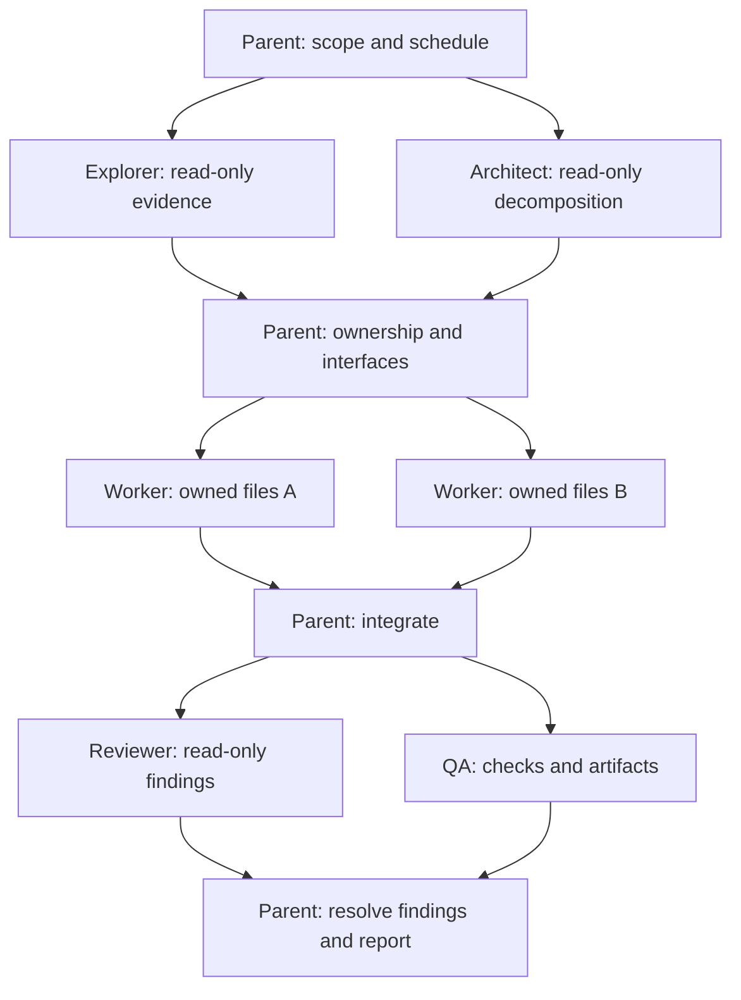

# Multi-agent architecture

The parent session is the orchestrator. It owns scheduling, task dependencies, shared interfaces, integration, and the final answer. Native Codex agents perform narrow, bounded tasks. The canonical workflow is [the harness skill](../.agents/skills/harness/SKILL.md).

## Roles and flow



Use only the roles needed for the task. A small edit may stay in the parent. Run exploration and architecture together only when their questions are independent; otherwise pass the explorer's evidence to the architect first. Review and QA may run together once the integrated candidate is stable.

| Agent | Owns | Does not own |
| --- | --- | --- |
| `harness_explorer` | Relevant code map and cited findings | Files, implementation, mutating commands |
| `harness_architect` | Response containing decomposition and interface proposals | Plan files, implementation, scheduling |
| `harness_worker` | Explicitly assigned implementation files | Others' edits or unassigned shared config |
| `harness_reviewer` | Actionable findings with location and trigger | Fixes or mutating checks |
| `harness_qa` | Test execution; assigned tests and verification artifacts | Product implementation or shared config |

## Task packet

Give every child enough context to work independently without copying the entire conversation:

```text
Run/task ID: project-v1 / pagination
Project root: confirmed absolute project path
Current packet: .harness/runs/project-v1/task-pagination/input.md
Objective: Add pagination to the list endpoint.
Role: harness_worker
Read scope: src/api/, tests/api/, AGENTS.md
Stable inputs: docs/pagination-contract.md plus captured fingerprints
Context: accepted decisions and explicit skill_paths in the current packet
Owned files: src/api/list.py, tests/api/test_list.py
Dependencies: Start after task schema_contract returns the agreed response fields.
Interface: Return items, next_cursor; invalid cursors return the existing error shape.
Acceptance criteria: Existing behavior remains valid; the second page has no duplicates;
invalid cursors fail with the expected status and body.
Checks: Run the relevant endpoint tests and report their command and result.
Peers: actual native agent IDs, roles, owned boundaries, and parent ID
Coordination: Ask focused questions and answer promptly. Share findings, blockers,
readiness, meaningful milestones, and handoffs. The parent confirms contracts.
Logging: record important messages, then send natively and record actual delivery;
read-only roles ask the parent to log. Correlate replies with the original event ID.
You are not alone. Preserve others' edits. No recursive delegation.
Return: run_id, task_id, status, summary, artifacts, checks, issues.
```

Read scope can overlap. Write ownership must be disjoint while tasks execute concurrently. Assign shared types, manifests, lockfiles, root instructions, and configuration to one owner. Workers propose changes outside ownership to the parent; the parent reassigns work or serializes it. Dependencies refer to returned, accepted outputs rather than an assumption that another agent has finished.

## Scheduling and handoff

1. Audit the existing harness and clarify only information needed to proceed.
2. Establish a compact dependency graph and interface contracts.
3. Check native compatibility with the first planned standby agent and inspect its actual spawn result before wider fan-out. With a returned child ID, register and reuse that agent, then spawn further independent tasks within actual capacity while continuing useful parent work.
4. Reuse an agent for related follow-ups with refreshed inputs, decisions, and skill paths. Register the actual native agent ID and its observed lifecycle separately from task status. Close unnecessary sessions with the actual runtime tool and record the observed outcome.
5. Inspect each result, reconcile interfaces, and integrate before dispatching dependent tasks.
6. Review and test the integrated change. Route confirmed defects back to the owning worker, then recheck the affected behavior.
7. Report completed work, actual evidence, and remaining limitations.

The project requests `max_concurrent_threads_per_session = 3` under `[agents]`; these are subagent threads coordinated by the parent session. The effective runtime can impose a lower limit. If a spawn fails due to capacity, inspect actual session states, collect pending results, and use the runtime's supported lifecycle tools before retrying. Waiting or marking a local task complete does not itself release native capacity. Exposed tools and discovered roles do not guarantee successful spawning. For `collab spawn failed: no thread with id`, stop further spawn attempts in that session, including retries with different roles. Follow the [compatibility preflight](compatibility.md#native-spawn-preflight-and-ephemeral-sessions). Do not abandon required substantive work or manufacture tool names.

Five role definitions do not mean five simultaneous agents. Spawn only concrete tasks that gain something from independent execution. Workers do not spawn their own agents. Hierarchical decomposition stays in the parent's dependency graph, with leaf tasks scheduled within the same bounded pool.

## Context refresh and session lifecycle

Use the [runtime guide](../skills/harness/references/runtime-guide.md) to initialize a v2 plan with `run.py`. It records an absolute project root, stable inputs and fingerprints, accepted decisions, explicit skill paths, and refreshed task packets. Editable product files belong in ownership rather than that task's immutable inputs. Accepted predecessor results and artifacts enter the packet through dependencies when the task starts. Accepted artifacts are immutable handoff outputs within that run: later edits make their producer/dependency fingerprints stale. Use separate stage outputs, assign shared-file changes to explicit parent integration, and revalidate affected results after integration changes them. Return individual output files or dedicated outputs directories, not a whole task/run directory containing result or lifecycle records.

Independent tasks receive small, self-contained packets. Related follow-ups reread the changed packet, files, and decisions. An independent reviewer can use fresh context when supported; do not assume a full conversation fork or a particular fork flag exists.

The parent creates new native agents with a standby-only instruction to wait for the refreshed packet without reading or writing product files, registers their actual IDs through `start` in `agents.json`, then dispatches the packet through the actual follow-up tool. Without a returned native child ID, do not call `run.py start`; a synthetic ID or the parent's ID cannot stand in for a child. A failed local registration prevents task dispatch. `run.py result` records task evidence but does not mark the native agent idle. Confirm actual idleness or a stop acknowledgment before reassigning write ownership; `stop_requested` alone is insufficient. Use the native follow-up tool to resume work and the native lifecycle tool to stop or close a session. The local CLI records observations; it does not perform those native actions.

`run.py resume` creates a new run, preserves prior records, and invalidates changed inputs/results plus affected descendants. `validate.py --project . --run ID --complete` checks required result evidence, artifacts, and freshness before the parent reports completion. Neither operation proves native execution.

## Active communication and explicit logs

Give children a peer roster with actual IDs and responsibilities. Agents should proactively share findings affecting peers, ask focused questions, answer promptly, propose contracts, report blockers with an exact request, and announce dependency readiness or handoffs. Meaningful milestones deserve a message; repetitive heartbeat chatter does not. Peers may discuss technical issues, while the parent retains scope and contract decisions.

A writer records an important outward event using `communication.py log` before invoking an actual native messaging tool. It then logs the real send outcome as a separate event linked through `reply_to`. Recipients correlate answers or acknowledgments with the original event ID. Read-only agents ask the parent to record and route actual messages. If native peer messaging is unavailable, the parent routes the exchange.

Events append under `_workspace/communications/<run-id>.jsonl` through the helper's concurrent append lock; optional Markdown exports are separate files. `recorded` means local persistence, `sent` requires a successful native transport result, and `received` requires observed receipt. None means that the recipient accepted a contract or finished work. These are explicit harness records, not automatic interception of every Codex internal message. Full commands and correlation examples are in the [runtime guide](../skills/harness/references/runtime-guide.md).

## Failure handling

A blocked child returns the exact dependency or failure and any useful partial findings. The parent resolves the dependency, narrows the task, or finishes it locally. Retry only when the input or environment has changed enough to justify another attempt. A child saying “complete” does not satisfy acceptance criteria without evidence.

If native tools are unavailable or the first spawn fails, the parent can complete suitable substantive work sequentially in the current session and report the limitation. Keep native tasks that never started pending and record parent work separately; do not use invented IDs or submit parent work as native child results to make completion validation pass. Required native-only checks remain `failed` or `not_run` according to the evidence, so this fallback cannot pass a native smoke test. Preserve an explicit ephemeral-session preference; ordinary persistent execution is an option only when that persistence is acceptable. The [compatibility guide](compatibility.md#native-spawn-preflight-and-ephemeral-sessions) separates historical ephemeral failures from current evidence.

When concurrent edits collide, stop assigning overlapping writes, inspect the combined diff, and preserve both contributors' intent. The parent owns reconciliation. Do not reset shared files to a prior version or overwrite the workspace to recover one task's result.

## Boundaries and verification

Agent TOMLs request `read-only` for exploration, architecture, and review, and `workspace-write` for implementation and QA. Session runtime overrides and platform restrictions affect the effective policy. File ownership and QA's prohibition on product edits are instruction boundaries, not per-path sandbox enforcement. Verify the effective runtime policy if it matters to the task. Native subagent configuration is described in [OpenAI's documentation](https://learn.chatgpt.com/docs/agent-configuration/subagents).

QA checks observable behavior at real boundaries, including outputs and failure cases. It starts with relevant checks and broadens only to address failures or remaining risk. Reviewer findings include severity, file/line, triggering scenario, impact, and remedy. The parent accepts results only after checking the agreed criteria.

Keep three kinds of evidence separate:

- **Static:** TOML/JSON parsing, required fields, links, and file layout.
- **Automated functional:** Install into temporary targets, preservation/conflict behavior, and generator/validator checks.
- **Live runtime:** Codex discovers the roles, starts distinct subagent sessions, returns results, and visibly overlaps independent tasks.

The [quickstart smoke test](quickstart.md#live-multi-agent-smoke-test) covers the final category. Syntax checks alone cannot establish it. No extra human approval gate is introduced by the planning, review, or QA roles; the parent follows the user's authorization and applicable runtime controls.
